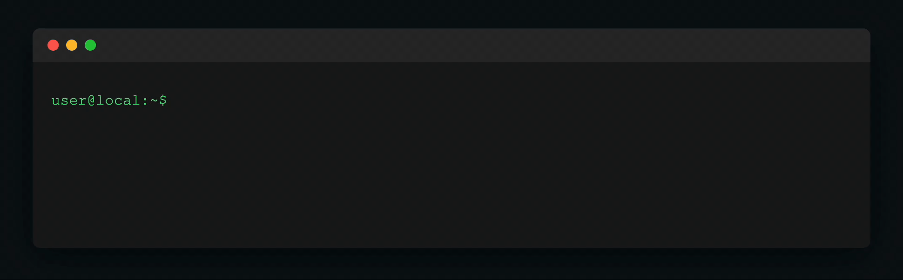

# mossh



**The easiest way to get started with the mobile shell (Mosh).**

If you use SSH daily but struggle with frequently dropped connections on trains, in cafes, and elsewhere, then Mosh might be for you.

The mobile shell (Mosh) is similar to interactive SSH, but the terminal sessions can survive network changes, roaming, and sleep.

## Why mossh?

Getting started with Mosh can be confusing, especially when you have little time to tinker with the Vanilla `mosh` command, or understand how it actually works.

This is where `mossh` comes in, as an easy and a quick way to evaluate the mobile shell (Mosh).

## How convenient?

Using `mossh` is dead simple:

If you are a developer who has an SSH configuration that allows you to `ssh myserver`, then you can `mossh myserver`, just as easily.

If this does not work, or if it has a hard time connecting, then you would know that Mosh is not supported in your envirnoment, and simply move on 😃

## How does it work?

`mossh` simplifies the process of getting started with Mosh by:

- Automatically installing the Mosh binaries on both the local and remote machines.
- Handling locale issues, which can be confusing when trying out Mosh for the first time.
- Handling situations where the target may or may not support Mosh due to inaccessible UDP ports.
- Accessing virtualised hosts using SSH after establishing a Mosh connection to the hypervisor node. This is particularly useful for home labs.

### The tradeoffs

Mosh isn't perfect, but it can be quite useful for unreliable networks or for keeping an eye on logs, and is worth trying. The `mossh` tool aims to make testing Mosh in your target environment as straightforward as possible.

As you start using Mosh you will notice that:

- ⚠️ **There is no scrolling** - terminal scrolling does not work, which is an inherent limitation of Mosh. If this is important to you, use tmux/screen or switch back to SSH when the ability to scroll is more important than the longevity of the session.
- ⚠️ **UDP ports are required** - in some cases, you may need to adjust your firewall and/or router settings in order to use Mosh.

## Install mossh

```bash
mkdir -p $HOME/.local/bin
curl -o $HOME/.local/bin/mossh \
    https://raw.githubusercontent.com/diraneyya/mossh/refs/heads/master/mossh
chmod +x $HOME/.local/bin/mossh
# Add to .bashrc if not already added, alternatively, choose
# an local bin folder other than "$HOME/.local/bin"
export PATH="$PATH:$HOME/.local/bin"
```

## Setup mossh

Add your remote server to `$HOME/.ssh/config`:

```sshconfig
# change myserver to any name you would like to use when
# connecting to the server using ssh or mossh
Host myserver
    # change this to the public IP address your target
    # can be accessed on
    HostName 1.2.3.4
    # the username
    User root
    # the SSH port
    Port 22
```

Open UDP ports 60001-60008 on your remote server:

```bash
sudo ufw allow 60001:60008/udp
```

This port range supports up to eight concurrent Mosh sessions using `mossh`, which are automatically selected based on availability by the underlying command, `mosh`. Each active connection uses a dedicated UDP port from this range.

For VPS providers such as DigitalOcean, Ionos and Hetzner, these ports need to be opened in the firewall settings of your admin dashboard. If you are using a remote host that is behind a home network or NAT, you must set up port forwarding on your router to enable Mosh.

## Use mossh

```bash
# Connect to a server via Mosh
mossh myserver

# Connect and immediately SSH to another host
# requires 'internal' to be configured in ~/.ssh/config on myserver
mossh myserver internal

# Use custom Mosh UDP port range
# (ports must be open or otherwise connectivity will fail)
mossh -p 60010:60020 myserver

# Show help
mossh --help
```

## Requirements

- SSH access to your server (configured in `~/.ssh/config`)
- One or more UDP ports open on the server (60001-60008 are tried by default)
- Mosh will be auto-installed on both local and remote if missing

## Learn More

- [Official Mosh website](https://mosh.org)
- [The tutorial that led to this convenience/evaluation script for Mosh](https://forum.proxmox.com/threads/use-mobile-shell-mosh-with-proxmox.173209/)
